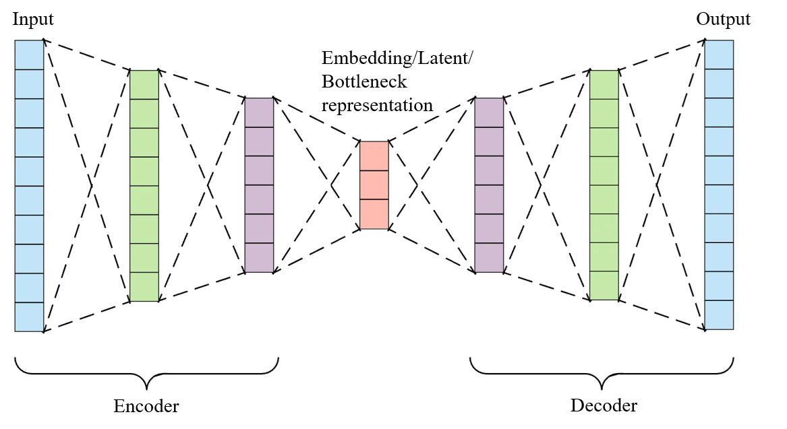
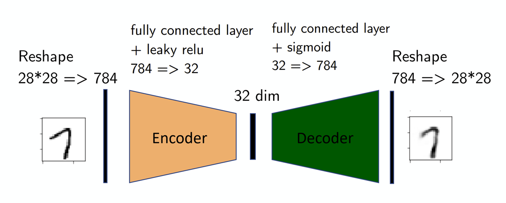
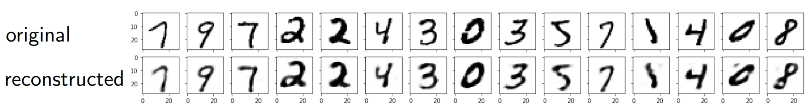
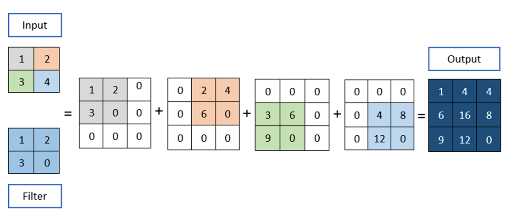

## Autoencoders

Autoencoders are a powerful form of unsupervised learning. They learn to find the most important features in data all by themselves.

#### Why Do We Need Autoencoders? The Limits of PCA

One of the most common unsupervised learning techniques for simplifying data is Principal Component Analysis (PCA). Its goal is to find a low-dimensional representation for high-dimensional data.

Imagine you have a complex dataset with many features, like a spreadsheet describing thousands of cars with columns for height, width, length, engine size, weight, etc. It's hard to visualize this data. PCA helps by finding a new, smaller set of features, called "principal components," that capture the most important information. The first component might represent the overall "size" of the car (a combination of length, width, and weight), capturing the biggest source of variation in the data.

**However, PCA has significant drawbacks:**

- It's Linear: PCA can only find straight-line relationships in data. It works well for data that is roughly shaped like an ellipse, but it fails on complex, curvy (non-linear) data.
- It can be slow: For datasets with a very large number of features or samples, PCA becomes computationally very expensive.

This is where Autoencoders shine. They are designed to overcome these limitations by learning complex, non-linear patterns in data.

### The Architecture of an Autoencoder: A Story of Compression and Reconstruction

At its heart, an autoencoder is a neural network designed for a simple yet powerful task: reconstructing its own input. Imagine taking a high-resolution image of the Mona Lisa, compressing it into a tiny file, and then trying to recreate the original masterpiece from only that compressed file.

An autoencoder has an "hourglass" shape and is made of two main parts: an Encoder and a Decoder.

- Encoder: This part of the network takes the high-dimensional input data (like a 28x28 pixel image) and compresses it down into a much smaller, dense representation. Its job is to capture the most important, informative features of the input.
- Bottleneck (or Latent Representation): This is the super-compressed, low-dimensional representation of the data. It's the "tiny file". If an autoencoder is trained on thousands of human faces, this bottleneck will learn to capture the essential features of a face—like eye spacing, nose shape, and jawline—in a very compact form.
- Decoder: This part takes the compressed bottleneck representation and does its best to reconstruct the original, high-dimensional input from it.

The entire network is trained to make the Reconstructed Input (X') as identical to the Original Input (X) as possible.

**How an Autoencoder Learns**

The learning process is all about minimizing the difference between what you put in and what you get out. This difference is called the reconstruction loss.

- **Forward Pass**: An input sample (e.g., an image x) is fed into the network. It passes through the encoder, is compressed into the bottleneck z, and then the decoder reconstructs it as x'.
- **Calculate Loss**: The network compares the original image x with the reconstructed image x'. A common way to measure the difference is the Mean-Square Error, which calculates the average of the squared differences between the pixels of the two images.

$$\mathcal{L}(x, x') = \|x - x'\|^2$$

- **Backward Pass:** The loss value is used to adjust the weights of all the neurons in the encoder and decoder through a process called backpropagation and gradient descent. The goal is to tweak the weights so that the next time the same input is shown, the reconstruction error will be smaller.

This process is repeated thousands of times with many different input samples. The encoder gets better at creating informative summaries (compressing), and the decoder gets better at using those summaries to create accurate reconstructions.

**Key Things to Tune:**

  * **Bottleneck Dimension:** This is a crucial setting. If the bottleneck is too small, it's like trying to summarize a whole novel in one word—you lose too much information, and the reconstruction will be poor. If it's too large, the network might just learn to copy the input without learning any meaningful features.
  * **Number of Layers:** Deeper encoders and decoders (more layers) can learn more complex patterns, which is necessary for complex datasets like high-resolution images.

### Types of Autoencoders: Fully-Connected vs. Convolutional

Just like other neural networks, autoencoders come in different flavors.The two main types are.

#### Fully-Connected Autoencoder

This is the most basic type of autoencoder, where the encoder and decoder are built using standard **fully-connected neural network layers**. In these layers, every neuron is connected to every neuron in the next layer.

These are best suited for lower-dimensional data, like data from a spreadsheet or simple, flattened images. For example, when applied to the MNIST dataset of handwritten digits, a 28x28 pixel image is first flattened into a vector of 784 numbers. The encoder compresses this down to a bottleneck of, say, 32 numbers, and the decoder then reconstructs the 784-pixel image.

#### Convolutional Autoencoder

When dealing with high-dimensional data that has a clear spatial structure, like images, **Convolutional Autoencoders (CAEs)** are far more effective. They use specialized layers from Convolutional Neural Networks (CNNs).

  * **The Encoder** uses **Convolutional layers** and **Pooling layers**. These layers are excellent at scanning an image and picking out important features like edges, textures, and shapes while progressively reducing the image's size (height and width).

  * **The Decoder** uses **Transposed Convolutional layers**. These layers do the opposite of convolution—they intelligently "upsample" or enlarge the feature maps, gradually rebuilding the image from the compressed bottleneck representation back to its original dimensions.

**What is Transposed Convolution?**
Think of a standard convolution as shrinking an input by sliding a filter over it. A transposed convolution essentially reverses this process. For each single value in its input, it multiplies that value by an entire filter to produce a larger output. Where these outputs overlap, they are summed up. This allows the network to learn the best way to upscale an image, rather than using a simple method like pixel duplication.

CAEs are powerful because they respect the spatial relationships between pixels and are much more efficient at handling images.

### Putting Autoencoders to Work: Real-World Applications

Autoencoders are more than just a clever academic concept. Their ability to learn meaningful features from unlabeled data makes them incredibly useful in many areas.

#### Anomaly Detection

This is one of the most popular uses for autoencoders. The strategy is simple but brilliant: **train an autoencoder exclusively on "normal" data.**.

**Example: Detecting Brain Injuries in CT Scans** 

1.  **Training:** You collect thousands of CT scans of healthy brains (normal data) and train a convolutional autoencoder on them. The autoencoder becomes an expert at compressing and reconstructing images of healthy brains, achieving a very low reconstruction error on this type of data.
2.  **Detection:** Now, you feed a new, unseen CT scan into the trained model.
      * If the scan is of a **healthy brain**, the model will reconstruct it perfectly, and the reconstruction error will be low.
      * If the scan shows an **abnormality** (like a tumor or hemorrhage), the model will struggle. Since it has never seen such features before, its attempt to reconstruct the image using its "normal brain" knowledge will fail, resulting in a blurry or distorted output and a **very high reconstruction error**.

By setting a threshold for this error, you can automatically flag images that are likely anomalous. This is a fully unsupervised method, as you never needed to show the model a labeled "abnormal" image.

#### Feature Extraction and Fine-Tuning

Labeled data is hard to get, but unlabeled data is everywhere. Autoencoders let us leverage this.

The **encoder** part of a trained autoencoder is, by itself, a powerful feature extractor. We can use it in a two-step process:

1.  **Unsupervised Pre-training:** Train an autoencoder on a massive, *unlabeled* dataset (e.g., millions of random images from the internet).
2.  **Supervised Fine-tuning:** Take the trained encoder part, attach a small classifier network to its end (the bottleneck), and then train this new, combined model on a very small, *labeled* dataset.

Because the encoder has already learned to recognize powerful, general features from the large dataset, the final classifier needs very little labeled data to achieve high accuracy.

#### Other Powerful Applications

  * **Image Denoising:** You can train an autoencoder by feeding it a noisy, corrupted image as input and teaching it to reconstruct the original, clean version. It learns to separate the signal from the noise.
  * **Data Compression:** The encoder can be used as a sophisticated, learned compression algorithm. The bottleneck representation is the compressed version of the data, which can be stored or transmitted efficiently and then decompressed by the decoder.

### Quiz --> [Autoencoders Quiz](./Quiz/AutoencodersQuiz.md) 

### Previous Topic --> [Long Short Term Memory (LSTM)](./LSTM.md)
### Next Topic --> [Variational Autoencoder Generative Adversarial Network](./VAE-GAN.md)

