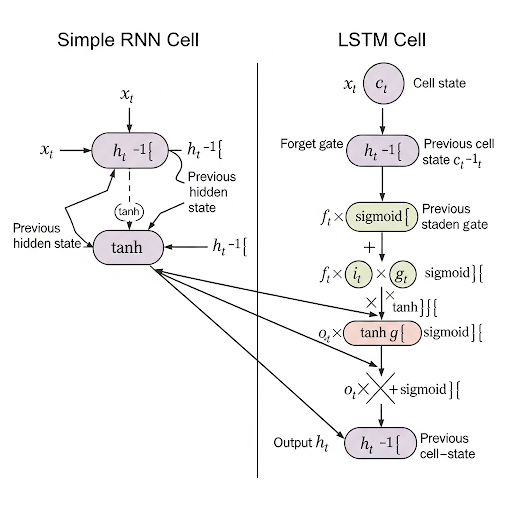

## Recurrent Neural Networks (RNNs) and Long-Short Term Memory (LSTMs)

Before diving into complex models, let's first understand the type of data they are designed for. **Sequential data** is information where the order of elements is crucial. If you change the order, you change the meaning.

* **Real-Life Example:** Think of a sentence. The words "Market falls into bear territory" have a specific financial meaning. If we reorder them to "Bear falls into market territory," the meaning changes completely into something nonsensical. Other examples include the frames in a video, the notes in a piece of music, or daily stock prices.

In this kind of data, elements depend on what came before them. This is called a **temporal dependency**.
* **Short-Range Dependency:** The meaning of the word "blue" in "the blue sky" depends directly on the words right before it.
* **Long-Range Dependency:** In the sentence, "I grew up in France... therefore, I speak fluent French," the word "French" at the end depends directly on the word "France" at the very beginning. Capturing these long-range dependencies is the biggest challenge in sequential modeling.

The main goal of **sequential modeling** is to create a system that can understand these dependencies and make predictions based on them. Common applications include machine translation, speech recognition, sentiment analysis, and stock price prediction.

### Recurrent Neural Networks (RNNs): The First Step with Memory

A **Recurrent Neural Network (RNN)** was one of the first deep learning models designed to handle sequential data. Unlike a CNN, which processes an entire image at once, an RNN processes data **one element at a time**, in order, while maintaining a form of **memory**.

**💡 The Core Idea: The Hidden State (Memory)**

The key innovation of an RNN is the **hidden state** ($h_t$), which acts as the network's memory. It's designed to retain information from all the past inputs it has seen.

Imagine you're reading a book. You don't just read each word in isolation. You maintain a running summary in your mind of the characters and plot points you've encountered so far. This mental summary is your "hidden state." As you read each new word (the input, $x_t$), you update your mental summary. Your understanding of the story at any point (the output, $y_t$) is based on this continuously updated summary.

At each time step `t`, the RNN performs two main calculations:
1.  **Update the Memory:** It updates its hidden state ($h_t$) by combining the current input ($x_t$) with its memory from the previous step ($h_{t-1}$).
2.  **Make a Prediction:** It uses this newly updated hidden state ($h_t$) to produce an output ($y_t$) for the current step.

This process is governed by a set of shared weights ($W_{hh}$, $W_{xh}$, $W_{hy}$) that are learned during training. The exact formulas are:
* `Hidden state update: h_t = tanh(W_hh * h_{t-1} + W_xh * x_t)`
* `Predicted output: y_t = λ(W_hy * h_t)`

The `tanh` function is an activation that squashes the hidden state values to be between -1 and 1.

**Training an RNN: Backpropagation Through Time (BPTT)**

To train an RNN, we use a process called **Backpropagation Through Time (BPTT)**.

After you finish a chapter of the book, you realize you misunderstood a key plot point. This is the "loss." To correct your understanding, you mentally go back through the pages **in reverse** (backward pass), figuring out which earlier sentences led you astray. Based on this, you adjust your interpretation (update the weights) so you don't make the same mistake in the next chapter.

BPTT "unrolls" the network through time, calculates the total loss as the sum of losses at each time step, and then backpropagates this error backward from the end of the sequence to the beginning to update the shared weights.

**😟 The Problem with RNNs: Vanishing Gradients**

While revolutionary, simple RNNs have a major flaw: they have **bad long-term memory**. This is caused by the **vanishing gradient problem**.

You're now reading a 500-page mystery novel. A tiny, crucial clue was mentioned on page 3. By the time you reach page 450, your mental summary (the hidden state) has been updated so many times that the memory of that initial clue has **faded away** or been overwritten. When you fail to solve the mystery at the end, your brain tries to trace the error back, but the connection to that distant clue on page 3 is too weak. You can't learn from your mistake because you can't remember what caused it.

**Technically, what happens?** During BPTT, the algorithm uses the chain rule to calculate the gradient. This involves many repeated multiplications of the derivative of the `tanh` function. As the graph shows, the `tanh` derivative is a small number (less than 1), and it's close to zero at its ends.

When you multiply many small numbers together (e.g., 0.2 x 0.1 x 0.2...), the result gets exponentially smaller and quickly "vanishes" toward zero.

**The Consequence:** The gradients for the early time steps become virtually zero. This means the model **cannot learn the connection between the beginning of the sequence and the end**. It effectively forgets the early inputs and focuses only on recent information.

### Long-Short Term Memory (LSTMs): A Superior Solution

To solve this problem, the **Long-Short Term Memory (LSTM)** network was created. It's an advanced type of RNN specifically designed to learn long-range dependencies.

**💡 The Core Idea: A Separate Long-Term Memory**

The brilliant innovation of the LSTM is the introduction of a **memory cell** (or **cell state**, $C_t$). This cell acts as a dedicated channel for **long-term memory**, separate from the **hidden state** ($h_t$), which now serves as the **short-term memory**.

You're a much more organized reader now. Instead of just a running mental summary, you have two tools:

1. A **Notebook (Cell State):** You use this to jot down crucial, long-term plot points (e.g., "The butler has a secret past").
2. A **Sticky Note (Hidden State):** You use this to track what's happening on the *current* page you're reading.

The cell state is like a conveyor belt. Information can flow along it mostly unchanged, making it easy for the network to remember things from the distant past. To control this powerful memory system, LSTMs introduce **gates**.

**The Gates: Regulators of Information Flow**

Gates are small neural networks within the LSTM cell that decide what information to allow through. They are composed of a sigmoid layer, which outputs a number between 0 and 1, acting like a switch (0 = "let nothing through," 1 = "let everything through").

There are three critical gates:

1. Forget Gate: What to erase from long-term memory

    This gate decides what information is no longer relevant and should be thrown away from the cell state.

    You read that a minor character, who you noted down, has just been written out of the story. Your forget gate decides this information is no longer needed, so you cross it out of your notebook to make room for new information.

    **How it works:** It looks at the current input ($x_t$) and the previous short-term memory ($h_{t-1}$) and outputs a number between 0 and 1 for each piece of information in the previous cell state ($C_{t-1}$).

2. Input Gate: What new information to store

    This gate decides which new information is important enough to be stored in the long-term memory (the cell state).

    You read a new, critical piece of information: "The main character found a mysterious key." Your input gate decides this is important. It first determines *what* to write ("found a key") and then *updates* your notebook with this new fact.

    **How it works:** It has two parts. A sigmoid layer decides *which values* to update, and a `tanh` layer creates a vector of *new candidate values* to be added.

3. Output Gate: What to use for the current prediction

    This gate decides what part of the long-term memory is relevant for the prediction at the current time step.

    Based on the current page and all the important notes in your notebook, your output gate decides what information is most relevant *right now*. It writes this filtered information onto your sticky note (the new hidden state, $h_t$), which you then use to understand the current action and make a prediction about what will happen next.
    
    **How it works:** It takes the current input and previous short-term memory to create a filter. It then passes the updated cell state through a `tanh` function and multiplies it by this filter to produce the final short-term memory ($h_t$).

### LSTM vs. RNN: The Sentiment Example

Let's revisit the sentence: **"The movie started off great with an engaging plot... but by the end, it became boring and predictable"**.

* **An RNN would likely fail:** The early positive words ("great," "engaging") would get diluted and overwritten in its single hidden state by the later negative words ("boring," "predictable"). Its final prediction would skew negative, having forgotten the positive start.

* **An LSTM would succeed:**
    * The **input gate** would store "great" and "engaging" in the long-term cell state early on.
    * This positive information would be carried along the cell state conveyor belt.
    * Even when the model processes "boring," the **forget gate** can decide to keep the initial positive sentiment because the word "but" signals a contrast.
    * The final **output gate** would be able to look at the entire context stored in the cell state—both the early positive and later negative information—to make a much more nuanced and accurate prediction.

### Quiz --> [Quiz](./Quiz/CNNQuiz.md) 

### Previous Topic --> [Convonutional Neural Networks](./CNN.md)
### Next Topic --> [Autoencoders](./Autoencoders.md)