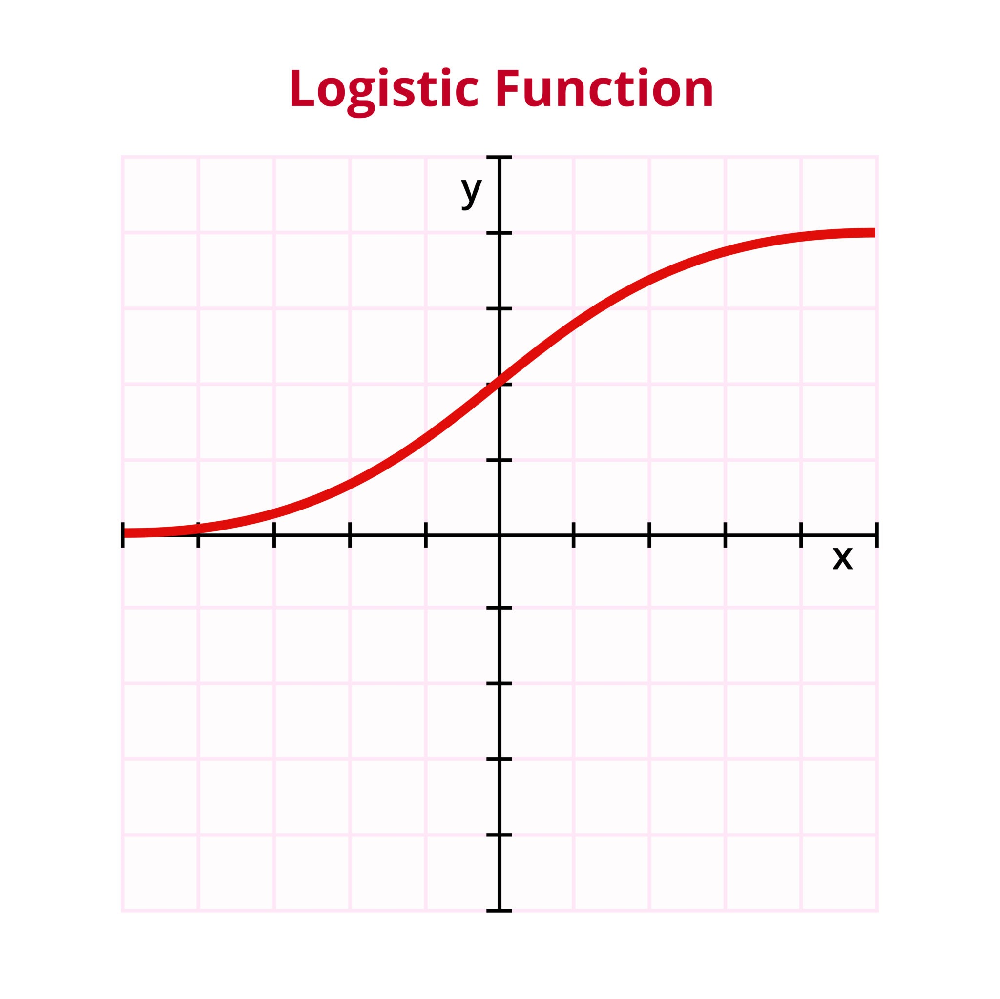

## Logistic Regression

Logistic regression is a statistical method used to predict a binary outcome, like yes/no or true/false. Think of it as a way to figure out the probability of something happening based on other known information. Unlike its cousin, linear regression, which predicts a continuous value (like house prices), logistic regression is all about classification.

Imagine you want to predict whether a student will pass or fail an exam based on the number of hours they studied. Logistic regression doesn't draw a straight line through the data points like linear regression would. Instead, it uses a special "S"-shaped curve, known as the sigmoid function.

    

This curve is perfect for this kind of problem because it always stays between 0 and 1. You can think of this as the probability of the outcome.
- If the output of the function is close to 1, it's highly likely the student will pass.
- If it's close to 0, they will probably fail.
- A value of 0.5 means it's a 50/50 chance.

The logistic regression model learns from past data (hours studied and exam results) to find the best "S" curve that fits the information. Once it has this curve, it can predict the probability of passing for a new student based on their study hours.

Let's say you want to build a spam filter. The goal is to classify an incoming email as either "spam" (1) or "not spam" (0). You can use logistic regression for this.

Here's how you might approach it:

1. Gather Data: You'd collect a bunch of emails and manually label them as either spam or not spam
2. Identify Features: You need to figure out what characteristics of an email might indicate it's spam. These are your "independent variables." They could include things like:
    - The number of times the word "free" appears.
    - Whether the email contains a link.
    - The sender's email domain.
    - The presence of all-caps words.
3. Train the Model: You feed this data into a logistic regression model. The model will analyze all the emails and learn the relationship between the features you identified and whether an email was labeled as spam. It will assign a "weight" to each feature. For instance, it might learn that the word "free" has a high positive weight, meaning its presence increases the probability of the email being spam.
4. Make Predictions: Now, when a new, unlabeled email arrives, your trained model can look at its features, apply the learned weights, and calculate a probability that the email is spam
5. Classify: You would set a threshold, typically 0.5. If the calculated probability is greater than 0.5, the email is classified as spam. If it's less than 0.5, it's marked as not spam.

### Odds?

Odds are the ratio of the probability of an event happening to the probability of it not happening

$$
\text{Odds} = \frac{\text{Probability of event happening}}{\text{Probability of event not happening}}
$$

For instance, if the probability of a student passing an exam is 80% (or 0.8), then the probability of them failing is 20% (or 0.2). The odds of them passing would be

$$
\text{Odds of passing} = \frac{\text{0.8}}{\text{0.2}} = 4
$$

This means the student is 4 times more likely to pass than to fail

### Odds Ratio

The odds ratio is a ratio of two odds. In logistic regression, we use it to compare the odds of an event happening in one group versus another, or how the odds of an event change when a variable increases by one unit

$$
\text{Odds Ratio} = \frac{\text{Odd Group 1}}{\text{Odd Group 2}}
$$

Let's go back to our spam filter example. Suppose we want to see how the presence of the word "free" affects the odds of an email being spam.

- Let's say the odds of an email being spam with the word "free" are 5 to 1 (meaning 5 spam emails for every 1 non-spam email)
- And the odds of an email being spam without the word "free" are 1 to 4 (meaning 1 spam email for every 4 non-spam emails).

$$
\text{Odds Ratio} = \frac{\text{Odds with "free"}}{\text{Odds without "free"}} = \frac{\frac{5}{1}}{\frac{1}{4}} = 20
$$

This odds ratio of 20 means that the odds of an email being spam are 20 times higher when the word "free" is present.

### Coefficient Vector

A coefficient vector is a set of numbers, arranged in a specific order, that represents the coefficients of a linear equation or model. In simpler terms, it's a way to neatly organize the "weights" or "importance" of each variable in a mathematical relationship.
Think of a simple linear equation:

y = 3x₁ + 2x₂ - 5x₃

In this equation:

- y is the outcome you're trying to predict.
- x₁, x₂, and x₃ are your input variables.
- 3, 2, and -5 are the coefficients. They tell you how much a one-unit change in each x variable affects the y variable

The coefficient vector, often denoted as β (beta), simply groups these coefficients together in an ordered list or vector:

$$
\beta = \begin{bmatrix} 3 \\ 2 \\ -5 \end{bmatrix}
$$

This vector provides a compact way to represent the entire set of relationships in the model.

In machine learning and statistics, coefficient vectors are fundamental to linear models. For example, in predicting a house price, your model might be:

Price = β₀ + (β₁ * Size) + (β₂ * Number of Bedrooms) + (β₃ * Age)

Here:

- β₀ is the intercept or bias term. It's the baseline price when all other variables are zero.
- β₁ is the coefficient for the Size (e.g., in square feet). It tells you how much the price increases for each additional square foot.
- β₂ is the coefficient for the Number of Bedrooms. It shows the change in price for each extra bedroom.
- β₃ is the coefficient for the Age of the house. This value would likely be negative, indicating that for each additional year of age, the price decreases.

If the model is trained and finds the following coefficients:

- β₀ = 50,000
- β₁ = 150
- β₂ = 25,000
- β₃ = -1,000

The coefficient vector would be:

$$
\beta = \begin{bmatrix} 50000 \\ 150 \\ 25000 \\ -1000 \end{bmatrix}
$$

This vector is the core of your predictive model. When you want to predict the price of a new house, you simply plug in its features (Size, Bedrooms, Age) and multiply them by their corresponding values in the coefficient vector. The goal of "training" a linear model is precisely to find the best possible values for this coefficient vector that make the most accurate predictions based on the data.

### Maximum Likelihood Estimations (MLE)

Maximum likelihood estimation (MLE) is a method used in statistics to estimate the parameters of a statistical model. In simpler terms, it's a way to find the most likely values for the variables in a model that best explain the data you've observed.

Imagine you find a coin and want to determine if it's a fair coin (50% chance of heads, 50% chance of tails) or if it's biased. To figure this out, you flip the coin 100 times and get 60 heads and 40 tails.

Now, you have a set of possible "models" or hypotheses about the coin's true probability of landing on heads:

- Hypothesis A: The coin is fair (Probability of heads = 0.5).
- Hypothesis B: The coin is slightly biased (Probability of heads = 0.6).
- Hypothesis C: The coin is very biased (Probability of heads = 0.7).

Maximum likelihood estimation asks the question: "Which of these hypotheses makes the observed data (60 heads and 40 tails) most likely?"

Let's think about it:

- If the coin were fair (Hypothesis A), getting 60 heads out of 100 flips is possible, but it's a bit of a deviation from the expected 50 heads. The likelihood of this outcome, given a fair coin, is a certain value.
- Now, consider Hypothesis B, where the probability of heads is 0.6. In this case, observing 60 heads and 40 tails is exactly what you would expect. The likelihood of this outcome, given this specific bias, is higher than in the fair coin scenario.
- With Hypothesis C, a 70% bias towards heads, you would have expected around 70 heads. Getting only 60 is less likely than with Hypothesis B.

Maximum likelihood estimation would choose Hypothesis B (Probability of heads = 0.6) because it's the parameter value that maximizes the probability of observing the data you actually collected. In essence, you are working backward from the data to find the model that best fits it.

### Ordinary Least Squares (OLS)

Ordinary Least Squares (OLS) is a statistical method used to find the best-fitting straight line through a set of data points. It's the most common technique for doing linear regression.

The main goal of OLS is to find a line that minimizes the vertical distances from each data point to that line.

Imagine you have a scatter plot of data points, like trees in a park. You want to draw a single straight path through the park that is as close as possible to all the trees at the same time.

How would you define the "best" path?

You could try to minimize the total distance from each tree to your path. Ordinary Least Squares does something very specific:

- For each tree (data point), it measures the vertical distance to your path. This distance is called a residual.
- Some residuals will be positive (point is above the line) and some will be negative (point is below the line). To avoid these cancelling each other out, OLS squares each of these distances.
- Finally, it adds up all these squared distances (or "errors").

The Ordinary Least Squares method finds the one unique line where this sum of the squared errors is the smallest it can possibly be. That's why it's called "least squares"—it minimizes the sum of the squared residuals.

Let's say you have a simple model you're trying to fit:

Y=β0​+β1​X
- Y is the dependent variable (what you're trying to predict).
- X is the independent variable (what you're using to predict).
- β₀ is the intercept (where the line crosses the Y-axis).
- β₁ is the slope of the line (how much Y changes for a one-unit change in X).

OLS is the process that calculates the optimal values for β₀ and β₁ that create the best-fitting line. It does this by finding the values that minimize the sum of the squared differences between the actual observed Y values and the predicted Y values from the line.

### Cost Function

A cost function, also known as a loss function, is a measure of how wrong a machine learning model's predictions are compared to the actual outcomes. The goal of training a model is to find a set of parameters that minimizes this function. Think of it as a "penalty score" for the model; the higher the score, the worse the model's performance.

Imagine you're playing a game of darts. Your goal is to hit the bullseye. The cost function is like a rule that assigns a penalty score based on how far your dart lands from the center. A dart on the bullseye has a cost of zero, while a dart that misses the board entirely has a very high cost.
In machine learning, the model "throws" predictions, and the cost function calculates the penalty. The training process is like a player adjusting their aim (the model's parameters) over many throws to consistently get the lowest possible score (minimize the cost).

Different types of models use different cost functions. For example, in Ordinary Least Squares (OLS) regression, the cost function is the sum of squared errors, which penalizes predictions that are far from the actual continuous values.

### Log-Likelihood

Log-likelihood is a concept that comes from the idea of Maximum Likelihood Estimation (MLE). While the math behind it can be complex, the core idea is simple.
The likelihood function measures how probable it is to observe the actual data you have, given a particular set of model parameters. A higher likelihood means the model's parameters do a better job of explaining the data. The goal of MLE is to find the parameters that maximize this likelihood.

Because multiplying many small probabilities together can lead to numerical instability (vanishingly small numbers), it's often mathematically easier to work with the logarithm of the likelihood function, or the log-likelihood. Since the logarithm of a function reaches its maximum at the same point as the function itself, maximizing the log-likelihood is the same as maximizing the likelihood

**The Connection: Using Log-Likelihood as a Cost Function**

Here's the crucial link: minimizing a cost function is the same as maximizing an objective function.
In many classification models, like logistic regression, the log-likelihood is used to define the cost function. However, there's a small twist: cost functions are typically minimized, while likelihood is maximized.
To solve this, we simply flip the log-likelihood function by taking its negative. This is called the Negative Log-Likelihood (NLL).

Cost Function = Negative Log-Likelihood

Therefore, minimizing the negative log-likelihood is mathematically identical to maximizing the log-likelihood.
So, when a data scientist says they are using "log-likelihood" as their cost function, they are technically using the negative log-likelihood. They are finding the model parameters that make the observed data most probable by penalizing parameters that make the data less probable. This specific cost function is also known as Log Loss or Cross-Entropy Loss.

### Decision Boundary

A decision boundary is a line or surface that separates the different classes or categories in your data. It's the line that a classification algorithm, like logistic regression, learns to divide the data into distinct regions.

Imagine a field where you have plotted the locations of two types of plants: roses 🌹 and daisies 🌼. The location of each plant is based on two features, such as the amount of sunlight and water it receives.

A decision boundary is like a fence you build in the field to separate the roses from the daisies.
- If a new, unknown plant pops up on one side of the fence, you would classify it as a rose.
- If it appears on the other side, you'd classify it as a daisy.

The goal of a classification algorithm is to learn the best possible placement for this "fence" based on the existing data.

In logistic regression, the decision boundary is determined by the point where the probability of belonging to a class is exactly 0.5. The model learns an equation that defines this line.

For a simple model with two features (x₁ and x₂), the equation might look like this:

β0​+β1​x1​+β2​x2​=0

This equation defines a straight line in the feature space. Any new data point that falls on one side of this line will have a predicted probability greater than 0.5 and will be classified as one class, while any point on the other side will have a probability less than 0.5 and will be classified as the other.

**Types of Decision Boundaries**

Decision boundaries don't always have to be straight lines. Their shape depends on the complexity of the model you use:

- Linear Decision Boundary: Simple algorithms like logistic regression and Support Vector Machines (SVMs) with a linear kernel produce straight-line decision boundaries. These are effective when the data can be separated by a single line.
- Non-Linear Decision Boundary: More complex algorithms like decision trees, k-Nearest Neighbors (k-NN), and SVMs with a non-linear kernel can create curved or complex-shaped decision boundaries. These are useful when the classes are intertwined and cannot be separated by a simple straight line.

In summary, a decision boundary is the dividing line that a classification model learns to separate different classes of data. It represents the "point of indecision" for the model, where it is equally likely to classify a data point into either category.

### Multiclass logistic regression

Multiclass logistic regression is an extension of binary logistic regression that allows you to classify data into more than two categories. While standard logistic regression is used for "yes/no" or "pass/fail" predictions, multiclass logistic regression handles situations where you might have three or more possible outcomes, such as classifying an image as a "cat," "dog," or "bird."

Because the underlying math of logistic regression is designed for two classes, there are clever strategies to extend it to handle multiple categories. The two most common methods are the One-vs-Rest (OvR) and the Multinomial (or Softmax) regression.

1. One-vs-Rest (OvR) or One-vs-All (OvA)

    This is the most straightforward and common approach. It breaks down a single multiclass problem into multiple binary classification problems.

    Here’s how it works for a problem with three classes (e.g., Cat, Dog, Bird):

    - Model 1 (Cat vs. Not Cat): You train a standard logistic regression model to distinguish between "Cat" (Class 1) and "everything else" (Dog and Bird, combined as Class 0).
    - Model 2 (Dog vs. Not Dog): You train a second model to distinguish between "Dog" (Class 1) and "everything else" (Cat and Bird, combined as Class 0).
    - Model 3 (Bird vs. Not Bird): You train a third model to distinguish between "Bird" (Class 1) and "everything else" (Cat and Dog, combined as Class 0).

    When you have a new, unseen data point, you run it through all three models. Each model will output a probability. The class corresponding to the model that outputs the highest probability is your final prediction. For instance, if Model 1 gives a 0.1 probability, Model 2 gives 0.8, and Model 3 gives 0.3, the final prediction would be "Dog."

2. Multinomial Regression (Softmax Regression)

    This approach is a bit more complex but is often preferred because it handles the multiclass problem in a single, unified model. Instead of training multiple independent binary classifiers, it generalizes the logistic regression model to directly output a probability distribution across all the classes.

    The key component here is the softmax function. This function takes the scores (or logits) that the model computes for each class and squashes them into a set of probabilities that add up to 1.0.

    For example, if the model computes raw scores of Cat=2.0, Dog=5.0, and Bird=1.0 for a new image, the softmax function would convert these into probabilities like P(Cat)=0.04, P(Dog)=0.90, and P(Bird)=0.06. Since the highest probability is for "Dog," that becomes the prediction.

### Quiz --> [Logistic Regression Quiz](./Quiz/LogisticRegressionQuiz.md)

### Previous Topic --> [Bayesian Decision Theory](./BayesianDecisionTheory.md)
### Next Topic --> [Parameter Estimation](./ParameterEstimation.md)

