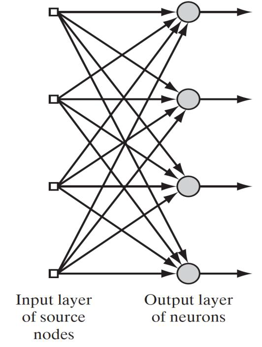
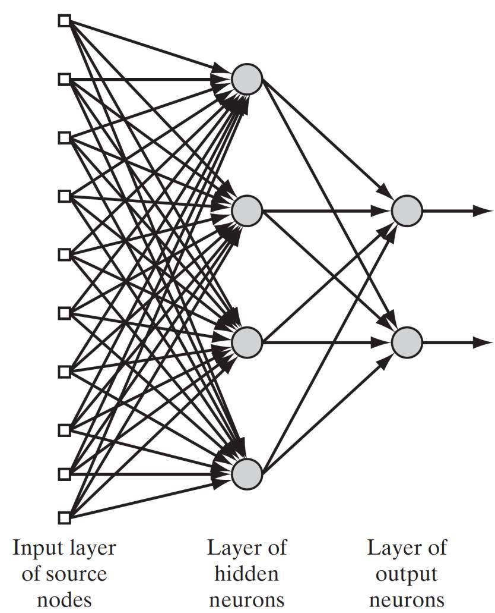
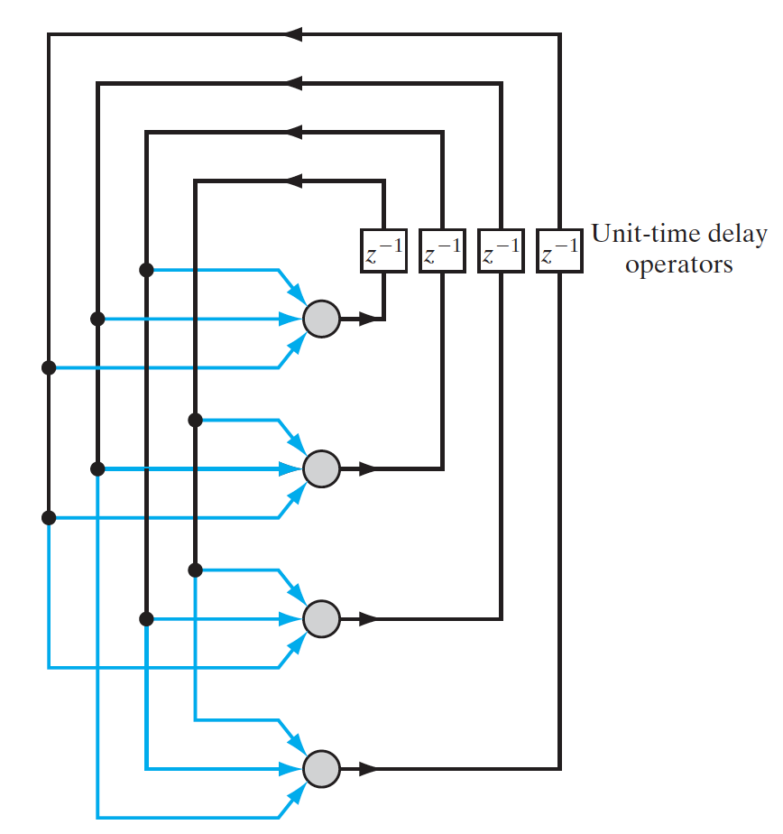

## Neural Network

A neural network is a computational model that's inspired by how the human brain works. It's essentially a system of interconnected "neurons" that process information and learn to perform specific tasks. Think of it like teaching a child to recognize a dog. You show them many pictures of different dogs, and they learn to identify the features that all dogs share, like four legs, a tail, and fur. A neural network learns in a similar way, adjusting the connections between its "neurons" to improve its performance as it's shown more data.

### Basic Components of a Neural Network

A neural network is made up of a few basic elements:

- Neurons: These are the fundamental processing units. They take in signals, perform a calculation, and then produce an output signal. In the brain analogy, a neuron is like a single brain cell.
- Synaptic Weights: The connections between neurons are called synapses, and each connection has a weight that represents its strength. This is like the importance a child places on a feature when learning. They might learn that four legs are more important for identifying a dog than its color.
- Activation Function: This function determines the output of a neuron. It's what decides if the signal is strong enough to be passed on to the next neuron. The activation function helps introduce non-linearity, which is crucial for solving complex problems.
- Bias: A bias is an extra input to a neuron that helps to shift the output. It's like a built-in "head start" for a neuron, making it easier or harder to activate.

### Neural Network Architecture

Neural network architecture describes how neurons are organized into layers and how these layers are connected to each other. The architecture is closely linked with the learning algorithm used to train the network

1. Single-Layer Feedforward Networks

    This is the simplest type of neural network. It consists of an input layer of source nodes that project directly to an output layer of neurons. No computation is performed in the input layer; it simply provides the input signals

    

        
    

2. Multilayer Feedforward Networks

    These networks are more complex, featuring one or more hidden layers located between the input and output layers. The neurons in these hidden layers are called hidden neurons or hidden units. The presence of hidden layers allows the network to extract higher-order statistics from the input, enabling it to solve more complex problems. In a fully connected network, every node in one layer is connected to every node in the adjacent forward layer.

    

        
    

3. Recurrent Networks

    A recurrent neural network is distinguished by having at least one feedback loop. This means the output of a neuron can be fed back as an input to itself or other neurons in the network. This characteristic gives the network memory, allowing it to process sequences of data.

    

        
    

### Knowledge Representation

In a neural network, knowledge representation refers to the way information is stored and encoded for use. The primary goal is for the network to learn and maintain a model of its environment. This knowledge is made up of two types of information: prior information and observations.

- Prior information is pre-existing knowledge about the problem.
- Observations are data points, which are often noisy due to sensor errors or system imperfections. These observations provide the examples used to train the network. The examples can be either labeled (paired with a correct response) or unlabeled.

A set of labeled or unlabeled examples represents the knowledge a neural network can learn through training. For instance, in a handwritten-digit recognition problem, the input is an image of a digit, and the labeled example includes the corresponding digit (0-9) as the desired output.

The role of knowledge representation is to ensure that

- Similar inputs from similar classes produce similar representations within the network, so they are classified as belonging to the same class.
- Items to be categorized as separate classes are given widely different representations.
- Important features are represented by a large number of neurons.
- Prior information and invariances are built into the network's design to simplify the learning process.

### Pattern Recognition

Pattern recognition is the process of assigning a received signal or pattern to one of a predetermined number of classes. Humans are naturally good at this, and neural networks perform the task by learning from a training process.

Here's a breakdown of how a neural network performs pattern recognition:

**The Process**

1. Training Session: The network is repeatedly shown a set of input patterns along with the class to which each pattern belongs. During this phase, the network learns to identify the features and characteristics that define each class.
2. Generalization: After training, the network is presented with a new, unseen pattern from the same population of data.
3. Classification: Based on the information it extracted during training, the network is able to identify and assign the new pattern to its correct class.

**Key Concepts**

- Decision Space: The patterns are represented as points in a multidimensional space. The neural network's training process divides this space into different regions, with each region corresponding to a specific class.
- Decision Boundaries: The "lines" or "surfaces" that separate these regions are called decision boundaries. The network learns to construct these boundaries based on the statistical variability within and between classes.
- Feature Extraction: A network can first perform feature extraction to transform a high-dimensional input pattern into a lower-dimensional feature vector, which simplifies the classification task. This is often done by an unsupervised network, followed by a supervised network for the final classification.

### Function Approximation

Function approximation, in the context of neural networks, is the process of using a network to learn and approximate an unknown, nonlinear input-output relationship from a set of labeled examples.

The goal is to design a neural network that can realize a function, 

F(x), that is close enough to the true but unknown function, f(x), for all possible inputs. This is typically measured in a Euclidean sense, aiming for a small approximation error, ϵ, where ∣∣F(x)−f(x)∣∣<ϵ for all x. This is possible if the training sample size is large enough and the network has a sufficient number of adjustable parameters (weights).

For example, if you have a dataset of house sizes and their prices, the unknown function, f(x), is the true relationship between size and price. A neural network would approximate this function, F(x), to predict the price of a new house based on its size, with a small margin of error.

### Perceptron

A perceptron is the most basic type of neural network, designed to make simple decisions based on a set of inputs. It's built from a single "neuron" and is used to solve problems where data can be separated by a single straight line.

**How a Perceptron Works**

Think of a perceptron as a simple decision-maker with a rule book.

- Inputs: First, it takes in a bunch of inputs, like different pieces of information. For example, to decide if a student should be admitted to a college, the inputs might be their GPA, test scores, and extracurricular activities.
- Weights: Each input is assigned a "weight," which represents how important that piece of information is. The perceptron multiplies each input by its corresponding weight. So, a high GPA might have a strong positive weight, while a poor essay might have a strong negative weight.
- Summing: The perceptron adds up all these weighted inputs. This gives it a single value that represents the overall "score" for that student.
- Bias (The "Tie-Breaker"): A bias is added to this score. Think of it as a baseline value that helps shift the decision. If the bias is positive, it makes the neuron more likely to fire; if it's negative, it makes it less likely. It gives the perceptron a little extra flexibility beyond just the inputs themselves.
- Decision: Finally, the perceptron uses an activation function (like a "hard limiter") to make the final decision. If the total score (weighted sum + bias) is above a certain threshold, the output is +1 (e.g., "admit the student"). If it's below the threshold, the output is -1 (e.g., "don't admit the student")

The perceptron's decision is always based on a straight line, which is why it can only solve problems that are linearly separable. Imagine plotting the student data on a graph with GPA on one axis and test scores on the other. The perceptron can only draw a single straight line to separate the admitted students from the rejected ones. If the data points for admitted and rejected students are mixed up and can't be separated by one straight line, a single perceptron won't be able to solve the problem.

### The Perceptron Convergence Theorem

The Perceptron Convergence Theorem states that if a set of data is linearly separable, the perceptron algorithm will eventually find a solution to perfectly classify all the data points. In other words, if a straight line can be drawn to separate the data, the algorithm is guaranteed to converge to a solution in a finite number of steps.

Imagine you have a basket of apples 🍎 and a basket of oranges 🍊. Your goal is to train a robot to distinguish between the two fruits. You have a bunch of measurements for each fruit, such as its redness and its roundness. You plot all these measurements on a graph.

Now, you draw a straight line on the graph. If you can draw this line so that all the apple data points are on one side and all the orange data points are on the other side, the data is linearly separable.

The Perceptron Convergence Theorem says that if this is the case—if you can indeed draw a straight line to separate them—your robot's learning algorithm is guaranteed to find that line. The robot might make mistakes at first, but with each mistake, it will adjust its line slightly until it finds a position where it can correctly separate all the apples from all the oranges. It won't keep trying forever; it will find a solution and stop.

### Relation Between the Perceptron and Bayes Classifier for a Gaussian Environment

The perceptron and the Bayes classifier are both statistical pattern classifiers, but they approach the problem of classifying data differently. The key difference lies in their assumptions about the data and their method of finding a decision boundary

- Perceptron: A Nonparametric and Adaptive Approach

    Think of the perceptron as a simple, on-the-fly learner. It makes no assumptions about the underlying distribution of the data. Instead, it learns by correcting its mistakes, focusing specifically on the data points it misclassifies. The perceptron's goal is to find a single, straight line (or a hyperplane in higher dimensions) that can perfectly separate the two classes of data points. The learning process is simple and adaptive, adjusting its weights based on each misclassified example.

    Imagine you're sorting email into "work" and "personal" folders. A perceptron learns by looking at one email at a time. If it misclassifies a "work" email as "personal," it adjusts its internal rules to be less likely to make that mistake again. It continues this process until it can correctly sort every email in its training set, as long as a clear separation exists between the two types of emails

- Bayes Classifier: A Parametric and Probabilistic Approach

    The Bayes classifier is a more methodical, statistical approach. It assumes a specific distribution for the data, such as a Gaussian (bell-curve) distribution. Its goal is to minimize the probability of making a classification error. It does this by calculating the probability of a data point belonging to each class and assigning it to the class with the highest probability. The Bayes classifier's decision boundary is positioned precisely where the probability distributions of the two classes cross.

    A Bayes classifier would first model the characteristics of "work" and "personal" emails, assuming certain statistical properties for each. For instance, it might determine the average number of keywords and the variance in those numbers for "work" emails versus "personal" emails. When a new email arrives, it calculates the probability that the email belongs to the "work" group and the probability that it belongs to the "personal" group based on these pre-defined models. It then assigns the email to the group with the higher probability, regardless of whether the two groups overlap.

| Feature | Perceptron | Bayes Classifier |
| :--- | :--- | :--- |
| **Method**| Adaptive, error-correction rule| Probabilistic, minimizes error probability|
| **Assumptions**| None (nonparametric)| Assumes a Gaussian distribution (parametric)|
| **Boundary**| Finds a linear boundary| Positions boundary where distributions cross|
| **Data Overlap**| Fails if data overlaps| Works even if data overlaps|
| **Application**| Simple, linearly separable problems| More robust for problems with overlapping data distributions|

### Batch Perceptron Algorithm

The Batch Perceptron Algorithm is a method for training a perceptron, but instead of updating the weights after every single mistake, it waits until it has processed a whole "batch" of misclassified examples before making a single update.

Imagine a teacher grading a batch of 100 homework assignments.

- A regular perceptron would be like a teacher who grades one paper, finds a mistake, and immediately goes back to the student to reteach the concept, then moves to the next student. This is the "single-sample correction" method. It's a bit chaotic and can be inefficient.
- The batch perceptron algorithm is like a teacher who grades all 100 papers first. As they grade, they make a list of all the problems the students got wrong. At the end, the teacher looks at this list and identifies the overall patterns of mistakes. Based on all the errors from the entire batch, they formulate a single, comprehensive lesson to correct the most common issues.

This "batch" approach is more stable and efficient because the adjustment to the weights is based on a collective set of errors, rather than a single, potentially noisy, data point. This makes the learning process more accurate and less prone to overreacting to individual errors.

The algorithm defines a cost function that measures the total error for all the misclassified samples in the batch. It then uses a method called gradient descent to find the best way to adjust the weights to reduce this total cost. The update is a single, large step in the direction opposite to the overall gradient of the cost function. This method is well-suited for solving nonlinear regression problems.

### Adaptive-Filtering Algorithm

An adaptive-filtering algorithm is a computational process that automatically adjusts its parameters to minimize the difference between its output and a desired signal. It is a fundamental concept in signal processing and machine learning, particularly within neural networks. The process involves two main components: filtering and adaptation.

1. Filtering Process: The algorithm takes an input signal and processes it to produce an output signal. For a neural network, this is a linear process where the input signals are multiplied by their respective synaptic weights and then summed up. The network also calculates an error signal, which is the difference between its output and the correct, desired output.
2. Adaptive Process: The error signal is then used to automatically adjust the synaptic weights of the network. This adjustment aims to minimize the error, making the network's output closer to the desired response. This creates a feedback loop where the network continuously learns from its mistakes.

Imagine you are on an airplane, and the constant humming of the engines is bothering you. Your noise-canceling headphones use an adaptive-filtering algorithm to solve this problem.

- Inputs: The headphones' microphone picks up the sound from the airplane engines. This is the input signal.
- Desired Output: The desired output is silence—you want to hear nothing but your music.
- Filtering: The headphones' internal processor takes the engine noise and creates an "anti-noise" sound wave. This is its output signal.
- Adaptation: The headphones compare the sound you are actually hearing (a mix of the original noise and the anti-noise) with the desired output (silence). This difference is the error signal. The algorithm uses this error to adjust the properties of the anti-noise in real time. If some engine noise is still getting through, the algorithm learns to modify the anti-noise to cancel it more effectively.

This feedback loop allows the headphones to continuously adapt to changes in the environment, such as the engine noise getting louder or quieter, to provide the best possible noise cancellation.

**Unconstrained optimization**

Unconstrained optimization, in simple terms, is the process of finding the best possible solution to a problem without any boundaries or limitations. In machine learning, it’s about finding the ideal set of weights for a model to minimize its error, without any constraints on what those weights can be.

Imagine you're trying to find the lowest point in a hilly landscape while blindfolded. Your only guide is a device that tells you which direction is "downhill." You start at a random location and take a step in the steepest downhill direction. You repeat this process, taking successive steps in the direction of the steepest descent, until your device tells you that there's no more "downhill" to go—meaning you've reached a valley floor. This is a local minimum, and in this process, you are not constrained by any fences, walls, or paths.

In the context of a neural network's adaptive-filtering algorithm, this "hilly landscape" is the cost function or error surface, which represents the error of the network based on its weights. The "location" in the landscape is the weight vector of the network. The "steepest downhill direction" is the gradient vector, which indicates the direction of the steepest increase in error. The goal is to find the minimum of this function, where the gradient is zero.

This process is considered "unconstrained" because the algorithm is free to choose any value for the weights to find the minimum of the cost function, without being restricted to a specific range or set of values. The algorithm simply tries to reduce the error at each step, ensuring that the new weight values lead to a lower error than the previous ones.

### Least-Mean-Square (LMS) Algorithm

The Least-Mean-Square (LMS) algorithm is a simple and widely used adaptive algorithm in machine learning that iteratively updates a filter's weights to minimize the mean square error (MSE) between the actual output and the desired output. In simple terms, it's a way for a system to learn from its mistakes and continuously adjust itself to get closer to the correct answer.

Imagine a musician tuning a guitar. Their goal is to match the sound of the string to a perfect, desired pitch.

- Actual Output: The sound produced by the guitar string as it is.
- Desired Output: The sound of the perfect note from a tuning fork.
- Error Signal: The difference between the two sounds—how "off" the guitar string's pitch is.

The LMS algorithm works like the musician's ear and hand. The musician listens for the error (the difference in pitch) and then adjusts the tuning peg (the weight) in a small, corrective step. This process is repeated over and over until the error is minimized and the guitar string is in tune.

The algorithm uses a simple formula to adjust the weights:

New Weight = Old Weight + (Learning Rate × Error × Input) 

- Learning Rate (η): This is a small, positive constant that controls how big of a step the algorithm takes. A smaller learning rate means smaller adjustments, leading to a more accurate but slower convergence. A larger learning rate can speed up learning but risks overshooting the optimal solution and becoming unstable.
- Error: This is the difference between the desired output and the actual output of the system.
- Input: This is the current data point being processed.

The LMS algorithm is popular because it's computationally simple and doesn't require complex calculations. It's often used in applications like echo cancellation in telecommunications, where a system continuously adapts to remove unwanted signals.

### Multilayer Perceptron (MLP)

A Multilayer Perceptron (MLP) is a type of neural network that consists of an input layer, one or more hidden layers, and an output layer. Unlike a simple perceptron, which can only handle linearly separable data, the MLP's hidden layers allow it to learn and model complex, non-linear relationships.

Think of an MLP as a team of specialists working together on a complex task.

- Input Layer: This is like the front office that receives all the initial information. For a problem like handwritten digit recognition, the input layer receives the pixel values of the image.
- Hidden Layers: These are the "specialist" teams. The first hidden layer might look at groups of pixels to identify basic features like lines and curves. The next hidden layer might take these lines and curves and combine them to recognize more complex shapes, like circles and straight lines, which are components of digits. By adding more hidden layers, the network can extract increasingly abstract features from the data. This is what allows the network to solve problems that are not linearly separable.
- Output Layer: This is the final decision-making team. It takes the processed information from the last hidden layer and makes a final classification. In the digit recognition example, the output layer would have ten neurons, one for each digit from 0 to 9, and the neuron with the highest activation would be the network's prediction.

The training proceed in two phases

1. Forward Phase

    In this phase, the network makes a prediction. The synaptic weights are fixed, and the input signal is propagated forward through the network, layer by layer, until it reaches the output. Think of this as the "trial run."

    Imagine a student is taking a multiple-choice test. The questions on the test are the input signals. The student has a fixed amount of knowledge (the synaptic weights), and they use this knowledge to answer each question. They go through the test from the first question to the last, writing down their answers. This entire process, from reading the questions to providing answers, is the forward pass. At the end, the student has a set of answers, which are the network's output signals.

2.  Backward Phase

    This phase is where the learning happens. The network calculates the difference between its prediction and the correct answer, creating an error signal. This error is then propagated backward through the network, from the output layer to the hidden layers, to adjust the synaptic weights.

    After the student finishes the test, the teacher grades it. The teacher compares the student's answers (the network's output) with the correct answers (the desired response). The difference between the two is the error signal. The teacher then uses this error to identify which concepts the student needs to work on. They don't just tell the student the final score; they go through the test in reverse, question by question, to pinpoint the source of each mistake. Based on this feedback, the student studies more effectively, which is analogous to the network adjusting its synaptic weights for the next training epoch.

By repeating this two-phase cycle over many epochs, the network's weights are gradually refined, and its performance improves, just as a student gets better with repeated practice and feedback.

When training a multilayer perceptron, there are two different approaches to learning: batch learning and on-line learning.

- Batch learning adjusts the network's synaptic weights after presenting all the examples in the training sample, which constitutes one complete training cycle, or epoch. The algorithm minimizes the average error energy over the entire training set. The weight adjustments are made based on the cumulative error from the entire batch of data.

    An advantage of this method is its ability to provide an accurate estimate of the gradient vector, which guarantees convergence to a local minimum under certain conditions. It also allows for parallelization of the learning process. However, it is demanding in terms of storage requirements because it needs to hold all the misclassified samples in memory to compute the adjustment. Batch learning is viewed as a form of statistical inference and is well-suited for solving nonlinear regression problems.

- On-line learning, also known as stochastic learning, adjusts the weights after the presentation of each individual training example. The goal is to minimize the total instantaneous error energy for each example.

    In a single epoch, the training examples are presented to the network one by one. After the first example is presented, the network's weights are adjusted. This process is repeated for every example in the batch. Because the training examples are presented randomly, the search for the optimal weights in the multidimensional space is stochastic.
    
    On-line learning requires much less storage than batch learning. It can also track small changes in a nonstationary environment and take advantage of redundant training data. It is highly popular for solving pattern-classification problems due to its simplicity and effectiveness with large-scale problems.

### Epoch

An epoch is one complete iteration of training a machine learning model on an entire dataset. During a single epoch, the model processes the whole training dataset, and its internal parameters are updated based on the error between the predicted and actual output.

The number of epochs is a hyperparameter that can be adjusted to improve the model's accuracy. Increasing the number of epochs can improve accuracy up to a certain point, after which it may lead to overfitting. Overfitting occurs when the model learns the training data too well, including its noise, and fails to generalize to new, unseen data.

### Activiation Function

An activation function is a mathematical function that determines the output of a neuron in a neural network. It takes the weighted sum of inputs and bias as its input, and then decides whether the neuron should "fire" or not. In a way, it introduces non-linearity, which is crucial for the network to learn complex patterns and functions.

Imagine a single neuron as a decision-maker for a security gate. The gate's decision to open or stay closed is the neuron's output.

- Incoming Signals: Signals (or inputs) arrive at the gate from various sensors, such as motion detectors, a facial recognition camera, and a weight sensor.
- Weighted Sum: Each sensor's signal is given a certain "importance" or weight. For example, a trusted facial recognition camera might have a very high weight, while a motion detector has a lower weight. The gate sums up all these weighted signals.
- Activation Function: This is the decision-making rule. The weighted sum is passed to the activation function, which determines the final action.

**Type of Activiation Function**

1. Threshold Function

    This function acts as a simple "on/off" switch. If the weighted sum of inputs is above a certain value, the output is 1; otherwise, it's 0. It's also known as the Heaviside function.

    Imagine a motion-activated security light. The motion detector's signal is the input. The threshold function sets a rule: if the motion signal is strong enough (e.g., a person walking by), the output is 1, and the light turns on. If the signal is too weak (e.g., a leaf blowing), the output is 0, and the light stays off.
2. Identity Activation Function

    The identity activation function is a linear activation function that outputs the input value directly without any modification. It's a straight-line function, mathematically expressed as φ(v)=mv, where 'm' is a constant. The derivative of this function is always a constant, which means the gradient has no relationship with the input data.

    **Why It's Problematic for Neural Networks**

    Because its derivative is a constant, the identity function is not suitable for the back-propagation process, which is how neural networks learn. In back-propagation, the network adjusts its weights based on the error gradient. Since the gradient for the identity function is always the same, the changes made by back-propagation are constant and don't depend on the input data. This severely limits the network's ability to learn and adjust to different inputs, making it incapable of solving complex, non-linear problems.

3. Sigmoid Function

    Also called the logistic function, this is a smooth, S-shaped curve that produces a continuous output between 0 and 1. This smooth transition allows for more nuanced decisions than a simple on/off switch.

    Think of a volume knob on a speaker. A threshold function would be like a button that either blasts music at full volume or mutes it completely. A sigmoid function is like a traditional volume knob that allows you to gradually increase the volume from 0 to 100%. The output smoothly increases as the input (how much you turn the knob) increases.

4. Tanh (Hyperbolic Tangent)

    The Tanh function is similar to the sigmoid but compresses its output to a range of -1 to 1. Because its output is centered at zero, it is often preferred over the sigmoid function.

    Imagine a thermostat that not only turns on the heat but also the AC. If the room is very cold, the thermostat's output is a large negative value (e.g., -1), causing the heater to stay off. If it's very hot, the output is a large positive value (+1), turning on the AC. For comfortable temperatures, the output is near 0, keeping both off.

5. ReLU (Rectified Linear Unit)

    ReLU outputs the input value directly if it's positive, but outputs 0 if the input is negative. This function does not saturate in the positive region, which helps avoid the vanishing gradient problem, making training faster for deep networks.

    A toll booth is like a ReLU function. If a car's toll is positive (e.g., $5), the booth processes the full amount. However, if the car is free (toll of $0 or less), the booth's output is 0, meaning it simply lets the car pass without collecting any money.

6. Leaky ReLU (Leaky Rectified Linear Unit)

    Leaky ReLU is an activation function used in neural networks that is a variant of the standard ReLU function. Unlike the standard ReLU, which outputs 0 for any negative input, Leaky ReLU allows a small, non-zero gradient for negative inputs. This helps to solve a problem known as the "dying ReLU" problem.

    Imagine a simple rule for an automated watering system in a garden. The system should turn on the water based on how sunny it is.

    - Standard ReLU: With a standard ReLU, the rule might be: "If the sun's intensity is positive, water the plants by that amount. If the sun's intensity is zero or negative (e.g., cloudy or nighttime), do not water at all." The problem is, if the sun is not out for a long time, the neuron can become inactive and "die," meaning it never learns or contributes to the system again.

    - Leaky ReLU: With a Leaky ReLU, the rule is slightly different. It's: "If the sun's intensity is positive, water the plants by that amount. If the sun's intensity is zero or negative, water the plants with a very small, fixed amount."

    This "leaky" behavior prevents the neuron from becoming completely inactive. The small, positive gradient for negative inputs means that even on a cloudy day, the neuron is still "alive" and can continue to learn and adjust its weights. This prevents the model from getting stuck in a state where some of its neurons stop learning completely, which is a common issue with standard ReLU. This is why it is preferred for deep neural networks.

7. ELU (Exponential Rectified Linear Unit)

    The ELU (Exponential Rectified Linear Unit) is an activation function used in neural networks. It's a lot like the popular ReLU function, but with a twist for negative inputs that helps the network learn more effectively.

    For any positive input, the ELU function behaves exactly like the ReLU function: it simply outputs the input value itself. So, if the input is 5, the output is 5.

    The key difference lies in how it handles negative inputs. Instead of just outputting 0 like ReLU, the ELU function outputs a negative value determined by an exponential curve. This curve is controlled by a parameter, α, which is typically a value between 0 and 1.

    This "negative leakage" has a crucial benefit: it helps the network's gradient remain non-zero for negative inputs. In simpler terms, it prevents the neuron from "dying" or becoming inactive, a common issue with ReLU, allowing the network to continue learning even when some inputs are negative. This feature helps the network converge faster and improves its performance.

    Imagine a car's cruise control system trying to maintain a set speed of 60 mph.

    - Positive Input (Uphill): If the car's speed drops to 55 mph (a negative input of -5), a traditional ReLU-like system would do nothing because the error is negative. The system would only "learn" and increase acceleration if the speed went over the target (a positive input).
    - ELU's Role: An ELU-based system, however, would have a slight negative output when the speed drops below the target. This small, negative value (e.g., -0.5) would cause the system to make a small, proportional adjustment to the accelerator, even though the error is in the negative direction. This continuous, subtle learning for both positive and negative errors allows the cruise control to maintain a much smoother and more accurate speed.
    
8. SoftMax

    The SoftMax function converts a vector of numbers into a probability distribution, where the sum of all outputs equals 1. It's commonly used in the output layer of a network for multi-class classification problems.

    Imagine a network trying to classify a picture of an animal as either a cat, a dog, or a bird. The final neuron outputs are 0.8, 0.1, and 0.1, respectively. The SoftMax function normalizes these so they add up to 1 (80% dog, 10% cat, 10% bird). It clearly indicates the network's confidence in its classification, with the highest probability corresponding to its prediction.

### Back Propagation Algorithm

The back-propagation algorithm is a powerful method for training a multilayer perceptron by adjusting the synaptic weights to minimize the error between the network's output and the desired response. The process is based on the delta rule, which states that the weight correction applied to a synapse is proportional to the learning rate, the local gradient of the neuron, and the input signal of that neuron.

### Rate of learning

The rate of learning, also known as the learning-rate parameter (η), controls how much the network's synaptic weights are adjusted with each step of the learning process. It determines the size of the correction applied to the weights based on the calculated error.

Imagine you are trying to find the bottom of a dark, uneven valley. The rate of learning is like the size of the steps you take.

- Small Learning Rate (Small Steps): If you take very small steps, you will move cautiously and smoothly down the valley. This approach ensures you don't miss the lowest point or become unstable and fall. The learning will be slow, but you are more likely to find the true minimum of the error
- Large Learning Rate (Large Jumps): If you take large jumps, you will move much faster. However, you risk overshooting the lowest point or landing on the other side of a hill, which can make your path unstable or even cause you to diverge from the correct path entirely.

In the context of a neural network, if the learning rate is too large, the weight adjustments can be so big that the network's performance becomes unstable or oscillates, preventing it from converging to a good solution. Conversely, if the learning rate is too small, the network will take a very long time to train.

To find a balance between speed and stability, a momentum term is often added to the learning process. This term helps the network to continue moving in a consistent direction and accelerate through flat areas of the error landscape, while still allowing for small adjustments to avoid overshooting.

### Stopping Criteria

When training a neural network, stopping criteria are the rules used to decide when to stop the training process. The goal is to train the network just enough so that it performs well without overfitting the training data.

Imagine you are a baker learning to make a new cake recipe. You want the cake to be perfectly baked—not undercooked and not burned.

- Undercooked (Underfitting): If you don't bake it long enough, it will be doughy and not ready. Similarly, if you don't train a network for enough epochs, it will not have learned the patterns in the data and will perform poorly.

- Burned (Overfitting): If you bake the cake for too long, the outside will get hard and black while the inside is perfect. The cake now only looks good on the inside. This is like overfitting, where a network learns the training data perfectly (including its noise) but fails to generalize to new, unseen data.

Stopping criteria are the timers and temperature checks you use to ensure the cake is just right. They help you find the "sweet spot" between underfitting and overfitting.

**Common Stopping Criteria**

1. Gradient Threshold: The back-propagation algorithm is considered to have converged when the Euclidean norm of the gradient vector reaches a sufficiently small value. This means the network is at a point where the error is no longer changing significantly with each adjustment of the weights. In the baking example, this is like waiting until your temperature checks show the oven has stabilized and the cake is no longer rising.

2. Rate of Change: Another criterion is to stop when the absolute rate of change in the average squared error per epoch is sufficiently small. This means the network is no longer learning anything new or useful. This is like deciding the cake is done when the change in its height has slowed to a stop.

3. Early-Stopping Method: This is one of the most widely used and effective methods. You split your data into a training set and a separate validation set. You then train the network and, at regular intervals (e.g., every five epochs), test its performance on the validation set. Initially, both the training and validation errors will decrease. However, a key sign of overfitting is when the training error continues to decrease, but the validation error begins to increase. This is the signal to stop training. The point where the validation error is at its minimum is the early-stopping point. This is like taking the cake out of the oven at the exact moment it's at its most golden-brown and delicious.

### XOR Problem

The XOR (Exclusive-OR) problem is a classic problem in machine learning that highlights the limitations of simple, single-layer neural networks and demonstrates why a more complex architecture with hidden layers is necessary.

Imagine you have a machine that can only make decisions based on a single, straight-line rule. Your job is to train this machine to distinguish between two different types of objects, say, "Group A" and "Group B."

The XOR problem is like trying to use this machine to sort objects that follow a very specific pattern:

- If you have two objects that are both "A" or both "B", they belong in one category (let's call it "Class 0").
- If you have two objects that are different (one "A" and one "B"), they belong in another category (let's call it "Class 1").

If you were to plot this on a simple graph, you would see that the data points for "Class 0" and "Class 1" are not neatly separated. You cannot draw a single straight line on the graph to separate the "both same" points from the "both different" points.

**Why a Single Perceptron Fails**

A single-layer perceptron can only learn a single straight line to divide its data. Because the data points in the XOR problem are not linearly separable, a single perceptron cannot find a line that correctly classifies all the points.

**The Solution: A Multilayer Perceptron**

To solve the XOR problem, you need a more advanced machine: a multilayer perceptron (MLP). This network has at least one hidden layer with multiple neurons. These hidden neurons work together to create multiple straight lines, which can then be combined to form a more complex, non-linear decision boundary that can correctly separate the mixed-up data.

In the context of the XOR problem, the hidden neurons learn to create two separate linear boundaries, and the output neuron then combines these boundaries to correctly classify the inputs.

Think of a simple security system that has two sensors on a door and window. The system should sound an alarm if one sensor is tripped but not both.

- Door and Window Closed (0,0): No alarm (output 0).
- Door Open, Window Closed (1,0): Alarm (output 1).
- Door Closed, Window Open (0,1): Alarm (output 1).
- Door and Window Both Open (1,1): No alarm (output 0).

This is a perfect example of the XOR problem. A simple system that can only draw one straight line won't work because the "no alarm" states (0,0) and (1,1) are not separable from the "alarm" states (1,0) and (0,1) with a single line. A more complex system with an internal processing layer would be needed to handle this logic.

### Loss Function

A loss function, also known as a cost function, is a method for evaluating how well a machine learning model is performing by measuring the penalty it incurs for incorrect predictions. In simple terms, it's a measure of the error between the model's predicted output and the actual, correct output. The goal of a neural network during training is to minimize this function.

#### Regression Loss Functions

These functions are used when the model is predicting a continuous value, like the price of a house or a person's height.

- Mean Squared Error (MSE): This is the most common loss function for regression. It calculates the average of the squared differences between the actual and predicted values. Squaring the errors means that larger errors are penalized more heavily.
- Mean Absolute Error (MAE): This function calculates the average of the absolute differences between the actual and predicted values. It doesn't square the errors, so it's less sensitive to outliers than MSE.
- Huber Loss: This function used in robust regression that is less sensitive to outliers in the data than the squared error loss. It combines the best aspects of Mean Squared Error (MSE) and Mean Absolute Error (MAE).
    - For small errors (when the absolute difference between the actual and predicted value is less than a certain threshold δ), it behaves like MSE, calculating the squared error.
    - For large errors (when the absolute difference is greater than or equal to δ), it behaves like MAE, calculating the linear error.

    This unique combination makes Huber loss a good choice when you want to penalize large errors more than MAE, but not as severely as MSE. The delta (δ) parameter defines the point where the function transitions from a quadratic to a linear loss.

#### Classification Loss Functions

These functions are used when the model is predicting a category or a class, like "spam" or "not spam."

- Binary Cross-Entropy (Log Loss): This is used for binary classification, where there are only two possible outcomes (e.g., 0 or 1). It penalizes the model based on the distance of its predicted probability from the actual value
- Categorical Cross-Entropy: This is used for multiclass classification problems where there are more than two classes (e.g., dog, cat, bird). It works similarly to binary cross-entropy but is designed to handle multiple classes.

### Bias And Variance

**Bias** is the error introduced by a machine learning model's inability to capture the true underlying relationship in the data. It happens when a model is too simple and makes strong, incorrect assumptions about the data, leading to a consistent and predictable error. Because the model is too rigid, it consistently fails to fit the data well, a condition known as underfitting. A model with high bias will perform poorly on both the training data and new, unseen data.

Imagine trying to fit a straight line to a set of data points that clearly follow a curve. The straight line is too simple and has a high bias because it cannot capture the curved relationship .

**Variance** is the error due to a machine learning model's sensitivity to small fluctuations in the training data. A model with high variance is very flexible and complex, fitting the training data almost perfectly. However, this high flexibility causes it to learn the noise and random variations in the training data, so it performs poorly on new, unseen data. This is known as overfitting.

Think of trying to fit a squiggly line to the same curved data. The squiggly line fits the training data perfectly, but it's so flexible that it changes wildly with different datasets . This difference in fit between different datasets is the variance.

**The Bias-Variance Tradeoff**

The goal of machine learning is to find a model that has both low bias and low variance. A simple model has high bias and low variance, while a complex model has low bias and high variance. Finding the optimal capacity for a model involves striking a balance between these two errors. This is often achieved through techniques like regularization, which lowers model complexity to prevent overfitting and improve generalization to new data.

### Regularization 

Regularization is a set of techniques used to prevent a machine learning model from overfitting during training. Overfitting happens when a model becomes too complex and learns the noise and random fluctuations in the training data, which causes it to perform poorly on new, unseen data. 

The core idea of regularization is to simplify the model by adding a penalty to the loss function. This penalty discourages the model from assigning excessively large weights to specific features, which helps it to generalize better.

- Overfitting (No Regularization): You give the student a practice test and they memorize the exact answers to every question, including the irrelevant details. When they take the real exam, the questions are slightly different, and because they only memorized the specific answers, they can't adapt and perform poorly. The student has overfit the practice test
- Regularization: Now, imagine you tell the student that for every specific, non-generalizable detail they memorize, they'll lose points on their overall grade. This forces the student to focus on understanding the core concepts rather than memorizing trivial facts. They learn a simpler, more generalized set of rules that can be applied to a wider range of questions, which leads to better performance on the actual exam.

In this example, the "points lost" for memorizing specific details is the penalty from regularization. It encourages the model to be simpler and more flexible, making it better at handling new information.

**Types of Regularization**

1. L1 Regularization (Lasso)

    L1 regularization adds a penalty that is proportional to the absolute value of the weights. This penalty encourages some weights to become exactly zero, effectively removing the corresponding features from the model.

    Imagine you're trying to figure out which ingredients are most important for baking a delicious cake. You have a long list of possible ingredients, from flour and sugar to obscure spices and food coloring. L1 regularization acts like a filter, automatically setting the importance (weight) of the less critical ingredients like a specific type of food coloring to zero. This simplifies your recipe, making it more robust and easier to replicate

2. L2 Regularization (Ridge)

    L2 regularization adds a penalty that is proportional to the square of the weights. This penalty forces the weights to be small but does not make them exactly zero. It reduces the magnitude of all the weights, making the model simpler and more stable.

    Using the same cake recipe, L2 regularization would reduce the importance of all the ingredients, but not eliminate any of them completely. For example, it might lower the weight of both flour and a minor spice, but it won't set the spice's weight to zero. This results in a more balanced recipe where no single ingredient has an overpowering influence

3. Dropout

    Dropout is a strategy used during the training of a neural network where some number of layer outputs are randomly ignored (dropped out) with a certain probability. This means that during each training step, a random subset of neurons is temporarily removed from the network along with their connections.

    Think of a team of students preparing for a final exam. Dropout is like randomly forcing a few students to be absent for each study session. Because the remaining students don't know who will be absent next, they are forced to work together and cannot rely on any single "star" student to do all the work. This makes the entire team more robust and capable of performing well even if a member is missing, just as dropout makes a neural network more resilient and less prone to overfitting.

### Optimizer

An optimizer is an algorithm that adjusts the weights of a neural network to minimize the loss function. Think of it as the "engine" that drives the learning process, guiding the model toward the best possible solution.

Imagine you are hiking in a foggy valley, and your goal is to find the very lowest point. You can't see the whole valley, but you have a tool that tells you which direction is the steepest way down.

1. Start Somewhere: You start at a random spot on a hill (this is the initial, random set of weights).
2. Check Your Slope: You use your tool to find the steepest downhill direction (this is the gradient of the loss function).
3. Take a Step: You take a step in that direction (this is the weight update). The length of your step is determined by the learning rate—a small step is cautious, a large step is bold.
4. Repeat: You continue this process, taking successive steps in the steepest downhill direction, until you reach the lowest point you can find.

Optimizers are different versions of this "downhill hiking" strategy, each with its own way of deciding where to step and how far to go.

**Type of Optimizers**

- Stochastic Gradient Descent (SGD)

    SGD is a fundamental optimization algorithm that updates the network's weights using a randomly selected subset of the training data, called a mini-batch, for each iteration. This approach makes SGD more computationally efficient than using the entire dataset at once, especially for large datasets.

    Imagine a chef tasting a large pot of soup. Instead of tasting the whole pot to decide if it needs more salt, they take a small spoonful from a random location. Based on that small taste, they add a pinch of salt to the entire pot. They repeat this process with another random spoonful until the soup tastes just right. This is like SGD—each "spoonful" is a mini-batch, and the "pinch of salt" is the weight adjustment.

- Momentum

    Momentum is an extension of SGD that helps accelerate the learning process by taking into account past gradients to smooth out the weight updates. It helps the optimizer to move more quickly in a consistent direction and avoid getting stuck in local minima, which are small "valleys" in the error landscape.

    Think of a marble rolling down a hilly landscape. As it rolls, it gains momentum, allowing it to easily roll over small bumps and flat areas without stopping. In machine learning, momentum helps the optimizer "roll" past noisy data points and shallow valleys to find a better, deeper minimum.

- RMSProp (Root Mean Square Propagation)

    RMSProp is an adaptive learning-rate optimizer that maintains a moving average of the squared gradients for each weight. It then divides the learning rate by the square root of this average. This means that for weights with large gradients, the learning rate is decreased, and for weights with small gradients, it's increased. This approach helps to prevent the learning from getting stuck in steep, narrow valleys.

    Imagine navigating a mountain range. Some paths are very steep and narrow, while others are wide and gentle. RMSProp is like having a smart map that automatically adjusts your step size: you take smaller steps on the steep, narrow paths to avoid overshooting and larger steps on the wide, gentle paths to move faster.

- Adam (Adaptive Moment Estimation)

    Adam is a highly popular and effective optimizer that combines the ideas of both Momentum and RMSProp. It calculates two moving averages: one for the average of the gradients (like momentum) and one for the average of the squared gradients (like RMSProp). By combining these two values, Adam can adapt the learning rate for each weight, making the training process faster and more stable.

    ontinuing the hiking analogy, Adam is like a hiker with a sophisticated GPS and a pedometer. The GPS tells the hiker the best overall direction (momentum), while the pedometer tracks how rugged the terrain is in each specific area (RMSProp). The hiker uses both pieces of information to adjust their stride length in real-time, allowing them to navigate all types of terrain efficiently and quickly find the lowest point in the valley.

### Approximations of Functions

Approximations of Functions in neural networks is the process of using a network to learn an unknown input-output relationship from data and create its own version of that function. The goal is for the network's function to be close enough to the real, unknown function that it can make accurate predictions.

**The Universal Approximation Theorem**

A key concept here is the Universal Approximation Theorem. This theorem states that a feedforward neural network with just a single hidden layer can approximate any continuous function to a desired level of accuracy. It's an "existence" theorem, meaning it guarantees that a solution exists, but it doesn't specify how to find that solution or that a single hidden layer is the most efficient design for a specific problem.

This is a powerful idea because it means that a single hidden layer is sufficient to solve a wide range of complex problems.

Imagine you want to build a model that predicts the price of a house. The real relationship between house features (square footage, number of bedrooms, location) and its price is a complex, unknown function. You don't have a formula for it, but you do have a lot of data from past sales.

1. The Unknown Function, f(x): This is the real, hidden relationship between house features and price.
2. The Training Data: This is your set of labeled examples, consisting of house features and their actual selling prices.
3. The Neural Network, F(x): You train a neural network on this data. The network's job is to learn the patterns and create its own function, F(x), that mimics the unknown function, f(x).
4. Approximation: The goal is for the network's function, F(x), to be close enough to the real function that when you give it the features of a new house, its predicted price is very close to the actual market price. The Universal Approximation Theorem gives you confidence that, with enough data and neurons, the network can indeed learn this complex relationship.

### Cross-Validation

Cross-validation is a technique used to assess a machine learning model's performance on data it wasn't trained on. It helps to validate the model and select the "best" one by using the available data more effectively.

The process begins by randomly partitioning the available dataset into two main parts: a training sample and a test set. The training sample is then further divided into two subsets: an estimation subset and a validation subset.

- Estimation Subset: This is the data used to train the model and select its parameters.
- Validation Subset: This data is used to validate the model's performance during training to guard against overfitting.
- Test Set: This is a completely separate set of data used to measure the final performance of the selected model.

The use of cross-validation is particularly useful when designing large neural networks to ensure they have good generalization—the ability to perform well on new, unseen data.

Imagine a student preparing for a final exam using a textbook.

- Entire Textbook: This is the full dataset available for learning.
- Practice Questions: The student uses a subset of questions at the end of each chapter to study. These are the estimation subset used to "train" their knowledge.
- Pop Quizzes: The teacher gives unannounced quizzes throughout the semester. These are the validation subset, used to check if the student is truly learning the concepts or just memorizing the practice questions.
- Final Exam: This is the test set. The student has never seen these questions before, so their performance on this exam is the true measure of their understanding and ability to apply their knowledge.

By using pop quizzes (validation) throughout the learning process, the student can identify and correct their weaknesses before the final exam, ensuring they are well-prepared to generalize their knowledge to new problems.

**Early-Stopping Method**

A popular application of cross-validation is the early-stopping method. This method involves monitoring the model's performance on the validation set during training. You train the network for a large number of epochs, but you stop when the validation error starts to increase, even if the training error is still decreasing. This is a clear sign that the model has started to overfit the training data and is no longer improving its ability to generalize. The point where the validation error is at its minimum is the early-stopping point.

### Quiz --> [Neural Network Quiz](./Quiz/NeuralNetworkQuiz.md)

### Previous Topic --> [Decision Tree](./DecisionTree.md)
### Next Topic --> [RBF & K-Mean Clustering](./RBF-K-MeanCluster.md)

